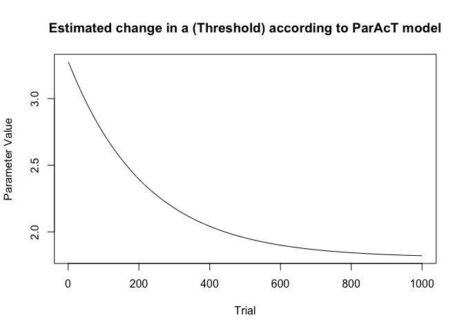

# ParAcT-DDM: A diffusion-based framework for modelling systematic, time-varying cognitive processes


- [R Tutorial](#r-tutorial)
  - [Load R Packages](#load-r-packages)
  - [Load data](#load-data)
  - [Define time-varying (ParAcT)
    functions](#define-time-varying-paract-functions)
  - [Assign ParAcT functions to diffusion model
    parameters](#assign-paract-functions-to-diffusion-model-parameters)
  - [Define Likelihood Function](#define-likelihood-function)
  - [Define parameter information for
    optimmization/fitting](#define-parameter-information-for-optimmizationfitting)
  - [Create optimization/fitting
    function](#create-optimizationfitting-function)
  - [Fit the models to data and compare
    performance](#fit-the-models-to-data-and-compare-performance)

This repository contains all of the code and data for the paper
“ParAcT-DDM: A diffusion-based framework for modelling systematic,
time-varying cognitive processes” by Alister and Evans (2025). Each of
the sub folders contain their own readme files that describe their
contents. Below, is a tutorial describing simple implementation of the
ParAcT framework in R.

To install all necessary packages in this repository, run
`renv::restore()` in the R console. If you are only doing the tutorial,
you can just run the first code chunk which will be a a bit quicker as
it only installs the packages necessary for the tutorial.

# R Tutorial

This tutorial provides a simple demonstration of how to fit ParAcT DDM
models to data in R. While most of these steps exist as scripts in this
repository, this tutorial will show a slightly simpler implementation
than what we did in our study/code base. Mainly, in our code we
performed Bayesian parameter estimation whereas this tutorial uses
non-Bayesian optimization. We do not do Bayesian estimation in this
tutorial because it is 1) more complicated and requires more steps and
more technical/mathematical knowledge and 2) takes a lot more time to
run. We do, however, believe Bayesian parameter estimation tends to be
more robust, so recommend using it over non-Bayesian methods in general.
In this tutorial we implement a simple version of the standard diffusion
model that assumes no random variability parameters.

**This tutorial is written in Quarto, which means you can download the
original README.qmd file (which renders this file) and play around with
the tutorial code yourself.**

## Load R Packages

``` r
# Load necessary libraries and install if not already installed.
install_and_load <- function(packages) {
  # Identify packages that are not installed
  missing_packages <- packages[!(packages %in% installed.packages()[, "Package"])]
  
  # Install missing packages
  if (length(missing_packages) > 0) {
    install.packages(missing_packages, quiet = TRUE)
  }
  
  # Load all packages
  load <- lapply(packages, library, character.only = TRUE) # assign to object so no messages are printed
}

# Specify the packages you need
required_packages <- c("here", "rtdists", "dplyr")

# Use the function to install and load the packages
install_and_load(required_packages)
```

## Load data

For this tutorial, we will us participant 1 of Data Set 2 (originally
from Evans et al., 2017). We called this data set “Norm” as it was the
experiment that did not include detailed block-level feedback, unlike
Data Set 1 from the same study.

``` r
load(here("data/evansetal-17/clean/P1-Norm-Trial.Rdata"))

# some extra cleaning of unnecessary columns for the sake of the tutorial
data <- data %>%
  select(Time, Resp, Stim, Trial, Block)

head(data)
```

       Time Resp  Stim Trial Block
    1 6.490    1 right     1     1
    2 8.578    2 right     2     1
    3 5.007    2 right     3     1
    4 2.343    2  left     4     1
    5 2.047    1  left     5     1
    6 4.363    1 right     6     1

You will notice that there are 5 columns. `Time` corresponds to the
response time (in seconds), `Resp` corresponds to accuracy, where “2”
equals correct and “1” equals incorrect. `Trial` and `Block` are the
corresponding experimental trial and block.

## Define time-varying (ParAcT) functions

In this tutorial, we will use exponential trial-varying functions as
this was the best performing model in our study. In the code, we define
all of the time-varying functions in
[modelling/time-varying-functions.R](modelling/time-varying-functions.R).
Although we only demonstrate one kind of time-varying function here,
hopefully this tutorial will make it clear how to easily implement
whatever time-varying function you like (see also the file referenced
above for all of the functions we used in our study).

First, let’s define non time-varying functions for models that include
parameters that do not change over time:

``` r
# Define non time varying functions

# Threshold (a)
a_standard = function(x, data){
  param<- x["a"]
  param
}

# Drift rate (v)
v_standard = function(x, data){
  param <- x["v"]
  param
}

# Non-decision time (t0)
t0_standard = function(x, data){
  param <- x["t0"]
  param
}

# z has slightly different rules as it changes based on the response stimulus (in the case of a random dot motion task, left direction/right direction)
z_standard = function(x, stimulus, all_stimuli, data) {
  if (stimulus == all_stimuli[1]) {
    z <- x["z"]
  } else if (stimulus == all_stimuli[2]) {
    z <- (1 - x["z"])
  } 
  z
}
```

Next, we can define the exponential trial-varying functions. If you
wanted the functions to vary over a different unit of time, like
experimental blocks or days, simply change `data$Trial` to the
appropriate column in the data set (e.g., `data$Block`, just make sure
you include that column in your data). Just like in the original
manuscript, in this tutorial we will only examine changes across time
for two parameters: *a* (decision threshold) and *v* (drift rate).

``` r
# As in the original study, we are only manipulating a and v across time. 
a_exp = function(x, data){
  a <- x["a.asym"]+x["a.start"]*exp(-x["a.rate"]*data$Trial)
  a
}

v_exp = function(x, data){
  v <- (x["v.asym"]+x["v.start"])-x["v.start"]*exp(-x["v.rate"]*data$Trial)
  v
}
```

## Assign ParAcT functions to diffusion model parameters

In this tutorial, we will define a standard (non-time varying) diffusion
model, an a-varying exponential ParAcT model and a v-varying exponential
ParAcT model. In our code, the time-varying functions are defined in
[modelling/model-functions.R](modelling/model-functions.R).

``` r
# Create a named list of each of the models, defining the time-varying functions for each parameter in each model 
all_functions <- list(
# simple is the standard diffusion model. Nothing is time-varying. 
  "simple" = list(
    a = a_standard,
    v = v_standard,
    z = z_standard,
    t0 = t0_standard
  ),  
  "a-exp" = list(
    a = a_exp, # a varies exponentially
    v = v_standard,
    z = z_standard,
    t0 = t0_standard
  ), "v-exp" = list(
    a = a_standard,
    v = v_exp, # v varies exponentially
    z = z_standard,
    t0 = t0_standard
  )
  )
```

## Define Likelihood Function

In our code, this is defined in
[modelling/likelihood-function](modelling/likelihood-function). Below is
the function that we used for all of the standard trial-varying and
block-varying functions in our study. Two ParAcT models in the original
study – the step function used in Data Set 1 and the Exp Trail with
Block Bump, required that the likelihood be calculated within each
block, so they used a slightly different likelihood function (but that
is not important for this tutorial).

The likelihood function below uses the package `rtdists` (specifically,
the `ddiffusion` function) to get the likelihoods of the models.

``` r
# log likelihood function
log.dens.like = function (x, data, par.names, functions) {
  out = 0
  names(x) = par.names
  stims = unique(data$Stim)
  
  # loop through the different response option (stim) because Z is estimated separately for each response option.
  for (stim in stims) {
    data_stim = data[data$Stim == stim,]
    
    # get the trials that correspond to the stimulus in the loop
    stim_time = data$Stim == stim
    
    # get estimates by applying ParAcT functions to parameters defined earlier. 
    a = functions$a(x, data = data_stim)
    t0 = functions$t0(x, data = data_stim)
    v = functions$v(x, data = data_stim)
    z = functions$z(x, data = data_stim, stimulus = stim, all_stimuli = stims)
    
    # assuming no random variability 
    sv = 0
    sz = 0
    st0 = 0
    s = 1
    
    # get diffusion model estimated using ddiffusion() from rtdists package. 
    tmp = ddiffusion(
      rt = data$Time[stim_time],
      response = data$Resp[stim_time],
      z = z * a,
      a = a,
      v = v,
      t0 = t0 - (st0 / 2),
      s = s,
      sv = sv,
      sz = sz,
      st0 = st0
    )
    out = out + sum(log(pmax(tmp, 1e-10))) # take the max of tmp and 1e-10 so that we never have log 0. 
  }
  out
}
```

## Define parameter information for optimmization/fitting

In this step, we need to define all of the parameters that are to be
estimated in the models, their upper and lower bounds, and the starting
point for the optimisation algorithm. In our code, we define this in
[modelling/priors.R](modelling/priors.R) but we do it a bit differently
because we define Bayesian priors. The underlying logic is pretty
similar, though: you need to tell the optimization/fitting function what
parameters you want to estimate, and define plausible ranges that the
true parameter can be between. In this tutorial, the parameters that we
need to define are all of the standard DDM parameters (z, t0, a , v) and
all of the time-varying parameters for the exponential functions (start,
asymptote, rate for each of v and a).

``` r
parameter_info <- list(
  a = list(
    start = 1,
    lower = 0,
    upper = 10,
    models = c("simple", "v-exp")
  ),
  t0 = list(
    start = 0.3,
    lower = 0,
    upper = 10,
    models = c("simple", "v-exp", "a-exp")
  ),
  v = list(
    start = 3,
    lower = -10,
    upper = 10,
    models = c("simple", "a-exp")
  ),
  z = list(
    start = 0.5,
    lower = 0,
    # z is between 0 and 1
    upper = 1,
    models = c("simple", "v-exp", "a-exp")
  ),
  # asymptote parameter
  a.asym = list(
    # for a (threshold)
    start = 1,
    lower = 0,
    upper = 10,
    models = "a-exp"
  ),
  v.asym = list(
    start = 3,
    lower = 0,
    upper = 10,
    models = "v-exp"
  ),
  # start parameter
  a.start = list(
    start = 1,
    lower = 0,
    upper = 10,
    models = "a-exp"
  ),
  v.start = list(
    start = 3,
    lower = 0,
    upper = 10,
    models = "v-exp"
  ),
  # rate parameter
  a.rate = list(
    start = .5,
    lower = 0,
    upper = 10,
    models = "a-exp"
  ),
  v.rate = list(
    start = .4,
    lower = 0,
    upper = 10,
    models = "v-exp"
  )
)
```

## Create optimization/fitting function

In this step, we need to find the parameter values that create the best
fit between the model and the data. As I mentioned earlier, in the
original study we use Bayesian MCMC to do this, but in this tutorial we
will use a much simpler, faster optimization technique: the `optim`
function in R.

The code chunk below contains two functions. First,
`extract_parameter_features` is a simple helper function that extract
some key details necessary for the optimization function from our list
defined above. Second `optimize_ddm` is the fitting function that uses
the `optim` function and our likelihood function that we defined earlier
to find the best fitting parameters given the data.

``` r
# create a function that extracts the relevant parameters and features (e.g., optimization ranges, start points) for a given model. 
extract_parameter_feature <- function(model_name, parameter_feature, parameter_info) {
  # Filter the parameters that include the specified model
  matching_parameters <- lapply(parameter_info, function(param) {
    if (model_name %in% param$models) {
      param[[parameter_feature]]
    } else {
      NULL
    }
  })
  
  # Remove NULL values (parameters that don't match the model)
  matching_parameters <- unlist(matching_parameters[!sapply(matching_parameters, is.null)])
  
  return(matching_parameters)
}

# Define optimization function for parameter estimation
optimize_ddm <- function(model, data, functions, parameter_info) {
  start_params <- extract_parameter_feature(model, "start", parameter_info) 
  lower_bounds <- extract_parameter_feature(model, "lower", parameter_info) 
  upper_bounds <- extract_parameter_feature(model, "upper", parameter_info) 
  par.names <- names(upper_bounds)
  
  # Perform optimization
  fit <- optim(
    par = start_params,
    fn = function(x) -log.dens.like(x, data = data, par.names = par.names, functions = functions),
    method = "L-BFGS-B",
    lower = lower_bounds,
    upper = upper_bounds,
    control = list(maxit = 1000)
  )
  
  # extract log likelihood
  log_likelihood <- -fit$value
  
  # get number of parameters
  n_params <- length(par.names)
  
  # get number of data points 
  n_obs <- nrow(data)
  
  # Extract results
  list(
    parameters = setNames(fit$par, par.names),
    log_likelihood = log_likelihood,
    convergence = fit$convergence,
    AIC = -2*(log_likelihood)+2*n_params,
    BIC = -2*log_likelihood+log(n_obs)*n_params
  )
  
}

# empty vector to store output for each model
model_names = c("simple", "a-exp", "v-exp")
all_output = vector("list", length = length(model_names))
names(all_output) = model_names
```

## Fit the models to data and compare performance

In this step, we will fit each of the three models to the data, extract
the parameter estimates, and figure out which model performed best.

Starting with the standard DDM (“simple” model), that assumes no
time-varying parameters.

``` r
# standard DDM
model <- "simple"
model_functions <- all_functions[[model]]
output <- optimize_ddm(model = model, data = data, functions = model_functions, parameter_info = parameter_info)
all_output[[model]] <- output # store output in list
output
```

    $parameters
            a        t0         v         z 
    2.2661636 0.3789976 0.4351850 0.4946401 

    $log_likelihood
    [1] -1596.88

    $convergence
    [1] 0

    $AIC
    [1] 3201.76

    $BIC
    [1] 3221.223

As shown above, the optimization algorithm performed as expected, with
good convergence and reasonable parameter estimates.

Now, let’s see the *a* Exponential ParAcT Variant:

``` r
# a Exponential ParAcT model
model <- "a-exp"
model_functions <- all_functions[[model]]
output <- optimize_ddm(model = model, data = data, functions = model_functions, parameter_info = parameter_info)
all_output[[model]] <- output
output
```

    $parameters
             t0           v           z      a.asym     a.start      a.rate 
    0.426696019 0.443726272 0.494567268 1.805895132 1.475471624 0.004582453 

    $log_likelihood
    [1] -1444.212

    $convergence
    [1] 0

    $AIC
    [1] 2900.423

    $BIC
    [1] 2929.618

And finally, the *v* exponential ParAcT variant:

``` r
# v exponential ParAcT model
model <- "v-exp"
model_functions <- all_functions[[model]]
output <- optimize_ddm(model = model, data = data, functions = model_functions, parameter_info = parameter_info)
all_output[[model]] <- output
output
```

    $parameters
              a          t0           z      v.asym     v.start      v.rate 
    2.270291098 0.381506024 0.495459615 0.108457135 0.560785442 0.003554196 

    $log_likelihood
    [1] -1581.902

    $convergence
    [1] 0

    $AIC
    [1] 3175.804

    $BIC
    [1] 3205

Comparing the models using AIC and BIC, we can see that the a
Exponential model outputs the lowest value for both models, suggesting
that it was the best candidate model for this participant (which is
consistent with the results in the main paper).

``` r
IC  <- list(
BIC = sapply(all_output, function(model) model[["BIC"]]),
AIC = sapply(all_output, function(model) model[["AIC"]])
)
IC
```

    $BIC
      simple    a-exp    v-exp 
    3221.223 2929.618 3205.000 

    $AIC
      simple    a-exp    v-exp 
    3201.760 2900.423 3175.804 

We can also plot the parameter trajectories using the estimated
parameter values. According to the best model, *a* followed an
exponential trajectory.

``` r
a_exp_params <- all_output$`a-exp`$parameters


plot_param_trajectory = function(estimates, param_function, title){
  # Define the time span the parameters vary across
  Trial <- 1:1000
  
  # turn into a data frame so it can fit with existing function 
  d = data.frame(Trial)
  
  # get the parameter values of the DDM parameter for each trial using the estimated ParAcT parameters
  value = param_function(x = estimates, data = d)
  
  # plot 
  plot(d$Trial, value, "l", xlab = "Trial", ylab = "Parameter Value", main = title)
}

plot_param_trajectory(estimates = a_exp_params, param_function = a_exp, title = "Estimated change in a (Threshold) according to ParAcT model")
```



As shown above, our model estimated fairly substantial exponential
changes in *a* across time.
